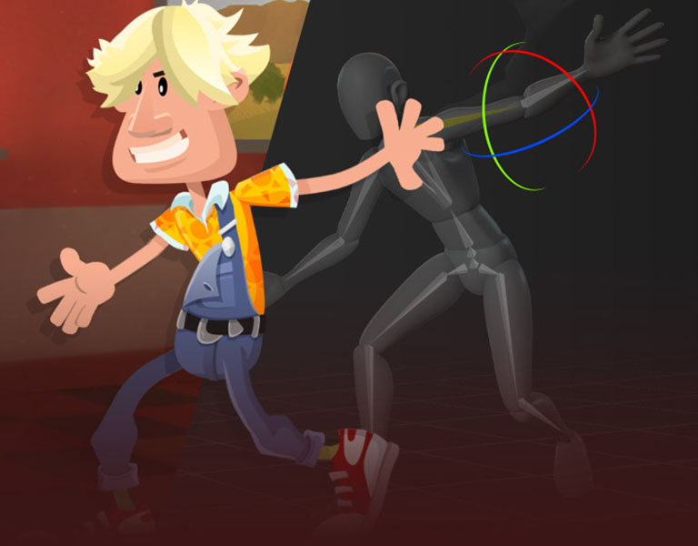

    

# Range Company Ltd - Animated Promo Video Hackathon

## Brief

Welcome to the Range Company Ltd Animated Promo Video Hackathon! We are a digital real estate company seeking talented 2D animators to create an engaging and informative promo video for our a real estate app. The animation will showcase the benefits of downloading the app and improve our online presence. We need your creativity to craft a captivating explainer video that resonates with our audience.

## Brand Personality

- **Friendly:** Infuse warmth and approachability into the animation.
- **Natural:** Emphasize a seamless and user-friendly experience.
- **Tech:** Showcase the app's technological advancements and innovation.
- **Energetic:** Keep the video dynamic and full of energy to grab attention.
- **Robust:** Demonstrate the app's reliability and robust features.

## Technical Deliverables

- **Duration:** 30 seconds to 2 minutes.
- **Format:** Motion graphic animation.
- **Platforms:** The video will be used on YouTube, Facebook, and Instagram.
- **Aspect Ratios:** Ensure compatibility for 1:1 and 16:9 (portrait and landscape mode).

## Timeline

- Hackathon Duration: August 1st to August 15th, 2023.

## Target Audience

- **Age:** 18-50 years.
- **Real Estate Conscious:** Individuals interested in real estate solutions.
- **Gender:** 65% Male, 35% Female.

## Pro Tips

- Make your concept groundbreaking and captivating to the audience.
- Use inspiring imagery, background music, voice-over, and sound effects.
- Draw inspiration from sites like Behance, Dribble, and Designspiration.

## Storyboard Guidelines

Your storyboard should visualize the animation sequence from the conceptual stage to the final product. Organize and structure it coherently to showcase your creativity and planning skills. Sketch the concepts for each scene using pen and paper or digital tools. You can include reference photography, illustrations, screenshots, and location shots to convey each scene effectively. Keep the storyboard colorful and minimalistic.

## Benefits

By participating in this hackathon, animators will enjoy the following benefits:

- **Certificate:** Participants will receive a certificate to recognize their contribution.
- **Allowance:** An allowance will be provided for participation.
- **National Service Opportunities:** National service opportunities may arise for exceptional participants.
- **Retainer After National Service:** Outstanding performers will be considered for a retainer based on meritocracy and performance evaluation.

## How to Get Started

1. Fork this repository to your GitHub account.
2. Create a new branch with a descriptive name for your animation project.
3. Develop your animation using any 2D animation software of your choice.
4. Save the final animation file in a suitable format for online platforms (MP4, MOV, etc.).
5. Create a sub-folder within the repository to include your storyboard sketches.
6. Record a short video or audio pitch (up to 2 minutes) explaining your animation concept and approach.
7. Commit and push all your work to your branch.
8. Submit a pull request to the main branch before the hackathon deadline.

## Evaluation Criteria

- Creativity and Originality
- Animation Quality and Fluidity
- Adherence to Brand Personality
- Message Clarity and Effectiveness
- Visual Appeal and Aesthetics
- Storyboard Organization and Structure
- Effective Use of Sound and Music

Let your imagination run wild, and create an animation that leaves a lasting impression on our audience. Good luck, and happy animating! 🎬🌟
